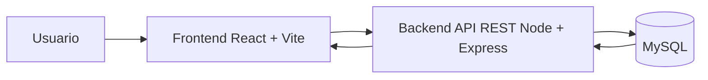

# ARCHITECTURE.md

# Arquitectura del proyecto SkillSwap

## Resumen del proyecto

SkillSwap es una aplicación web de trueque de habilidades técnicas. La idea principal es que los usuarios puedan publicar habilidades que saben hacer y solicitar intercambios con otros usuarios para aprender nuevas habilidades sin pagar dinero directamente.

Ejemplo:

- Un usuario publica que sabe HTML y CSS.
- Otro usuario publica que sabe JavaScript.
- Ambos pueden solicitar un intercambio de conocimientos.

La primera entrega funcional debe permitir demostrar este flujo mínimo:

```text
Registro → Login → Crear habilidad → Ver habilidades → Solicitar intercambio
```

---

## Stack tecnológico oficial

| Capa | Tecnología |
|---|---|
| Frontend | React + Vite |
| Backend | Node.js + Express |
| Base de datos | MySQL |
| Autenticación | JWT |
| Cifrado de contraseñas | bcrypt |
| Conexión a MySQL | mysql2 |
| Peticiones HTTP frontend | Axios |
| Rutas frontend | React Router DOM |
| Variables de entorno | dotenv |
| Control de versiones | Git + GitHub |
| Editor recomendado | VS Code |
| Asistente IA | Codex / ChatGPT |

---

## Tipo de arquitectura

La aplicación usa una arquitectura **cliente-servidor de 3 capas**.

```text
Usuario
  ↓
Frontend React + Vite
  ↓ HTTP / API REST
Backend Node.js + Express
  ↓ SQL
Base de datos MySQL
```

También puede considerarse una aplicación tipo **SPA** porque React permite cambiar de vistas sin recargar completamente la página.

---

## Diagrama general



---

## Responsabilidad de cada capa

## 1. Frontend

El frontend es la parte visual que usa el usuario desde el navegador.

Responsabilidades:

- Mostrar páginas.
- Gestionar formularios.
- Enviar peticiones al backend.
- Guardar el token JWT en `localStorage`.
- Mostrar errores y mensajes de éxito.
- Proteger rutas visuales según si el usuario está logueado.
- Permitir crear habilidades y solicitar intercambios.

Tecnologías:

- React.
- Vite.
- Axios.
- React Router DOM.
- CSS.

---

## 2. Backend

El backend contiene la lógica principal de la aplicación.

Responsabilidades:

- Registrar usuarios.
- Iniciar sesión.
- Cifrar contraseñas con `bcrypt`.
- Generar tokens JWT.
- Verificar tokens JWT.
- Proteger rutas privadas.
- Conectar con MySQL.
- Crear habilidades.
- Listar habilidades.
- Crear solicitudes de intercambio.
- Aplicar reglas de negocio.

Tecnologías:

- Node.js.
- Express.
- mysql2.
- bcrypt.
- jsonwebtoken.
- dotenv.
- cors.

---

## 3. Base de datos

La base de datos guarda la información persistente de la aplicación.

Motor:

```text
MySQL
```

Base recomendada:

```text
skillswap_db
```

Tablas principales para la primera entrega:

- `roles`
- `users`
- `skills`
- `requests`

Tablas preparadas para fases posteriores:

- `exchanges`
- `ratings`

---

## Estructura recomendada del proyecto

```text
SkillSwap/
├── backend/
│   ├── package.json
│   ├── .env
│   └── src/
│       ├── app.js
│       ├── server.js
│       ├── routes/
│       │   ├── auth.routes.js
│       │   ├── users.routes.js
│       │   ├── skills.routes.js
│       │   └── requests.routes.js
│       ├── controllers/
│       │   ├── auth.controller.js
│       │   ├── users.controller.js
│       │   ├── skills.controller.js
│       │   └── requests.controller.js
│       ├── models/
│       │   ├── user.model.js
│       │   ├── skill.model.js
│       │   └── request.model.js
│       ├── middleware/
│       │   └── auth.middleware.js
│       └── config/
│           └── db.js
│
├── frontend/
│   ├── package.json
│   └── src/
│       ├── main.jsx
│       ├── App.jsx
│       ├── pages/
│       │   ├── LoginPage.jsx
│       │   ├── RegisterPage.jsx
│       │   ├── DashboardPage.jsx
│       │   └── SkillsPage.jsx
│       ├── components/
│       │   ├── Navbar.jsx
│       │   └── SkillCard.jsx
│       ├── services/
│       │   ├── api.js
│       │   ├── authService.js
│       │   ├── skillsService.js
│       │   └── requestsService.js
│       ├── context/
│       │   └── AuthContext.jsx
│       └── styles/
│           └── global.css
│
├── database/
│   └── skillswap.sql
│
├── ARCHITECTURE.md
├── IA_CONTEXT.md
├── ROADMAP.md
├── modelo_relacional_completo.md
├── practica-2-arquitectura-proyecto.md
└── plan_entrega1.md
```

---

## Backend: organización interna

### `app.js`

Debe configurar Express:

- `express.json()`.
- `cors()`.
- Rutas principales.
- Ruta de prueba.
- Manejo básico de errores.

### `server.js`

Debe arrancar el servidor.

Puerto recomendado:

```text
3000
```

### `config/db.js`

Debe crear la conexión a MySQL usando `mysql2/promise`.

Debe leer variables desde `.env`.

### `routes`

Define las rutas HTTP.

Endpoints principales:

```text
POST /api/auth/register
POST /api/auth/login
GET /api/users/me
GET /api/skills
GET /api/skills/:id
POST /api/skills
POST /api/requests
GET /api/requests
```

### `controllers`

Contiene la lógica de cada endpoint:

- Validar datos.
- Llamar al modelo.
- Aplicar reglas de negocio.
- Devolver respuesta JSON.

### `models`

Contiene consultas SQL.

Regla importante:

```text
Usar consultas preparadas. No concatenar SQL con datos del usuario.
```

### `middleware`

Contiene funciones intermedias.

El middleware principal es:

```text
auth.middleware.js
```

Sirve para verificar JWT y proteger rutas privadas.

---

## Frontend: organización interna

### `pages`

Pantallas principales:

- `LoginPage.jsx`
- `RegisterPage.jsx`
- `DashboardPage.jsx`
- `SkillsPage.jsx`

### `components`

Componentes reutilizables:

- `Navbar.jsx`
- `SkillCard.jsx`

### `services`

Archivos para llamar al backend:

- `api.js`: instancia de Axios.
- `authService.js`: login y registro.
- `skillsService.js`: habilidades.
- `requestsService.js`: solicitudes.

### `context`

Estado global del login:

- `AuthContext.jsx`

### `styles`

Estilos globales:

- `global.css`

---

## API REST mínima

## Auth

| Método | Endpoint | Descripción | Protegida |
|---|---|---|---|
| POST | `/api/auth/register` | Registrar usuario | No |
| POST | `/api/auth/login` | Iniciar sesión | No |
| GET | `/api/users/me` | Obtener usuario actual | Sí |

## Skills

| Método | Endpoint | Descripción | Protegida |
|---|---|---|---|
| GET | `/api/skills` | Listar habilidades | No |
| GET | `/api/skills/:id` | Ver detalle de habilidad | No |
| POST | `/api/skills` | Crear habilidad | Sí |
| PUT | `/api/skills/:id` | Editar habilidad | Sí, opcional |
| DELETE | `/api/skills/:id` | Eliminar habilidad | Sí, opcional |

## Requests

| Método | Endpoint | Descripción | Protegida |
|---|---|---|---|
| POST | `/api/requests` | Crear solicitud de intercambio | Sí |
| GET | `/api/requests` | Ver solicitudes del usuario | Sí |

---

## Modelo de datos mínimo

## `roles`

```text
id
name
```

## `users`

```text
id
username
email
password
role_id
created_at
```

## `skills`

```text
id
user_id
title
description
created_at
```

## `requests`

```text
id
requester_id
skill_id
status
created_at
```

## `exchanges`

```text
id
request_id
agreed_at
status
```

## `ratings`

```text
id
exchange_id
rated_by
rated_to
score
comment
created_at
```

---

## Reglas de negocio importantes

- Un usuario puede publicar muchas habilidades.
- Una habilidad pertenece a un solo usuario.
- Un usuario puede solicitar muchas habilidades.
- Una habilidad puede recibir muchas solicitudes.
- Un usuario no puede solicitar su propia habilidad.
- Una solicitud aceptada puede generar un único intercambio.
- Una valoración solo debe existir después de un intercambio completado.
- Para la primera entrega, `ratings` no es obligatorio.
- Para la primera entrega, `exchanges` puede quedar preparado pero no es obligatorio en interfaz.

---

## Flujo de autenticación

```text
1. Usuario envía email y contraseña.
2. Backend busca el usuario por email.
3. Backend compara contraseña con bcrypt.
4. Backend genera JWT.
5. Frontend guarda JWT en localStorage.
6. Frontend envía JWT en Authorization Bearer.
7. Backend verifica JWT en rutas privadas.
```

Formato del header:

```text
Authorization: Bearer TOKEN
```

---

## Variables de entorno del backend

Archivo:

```text
backend/.env
```

Contenido recomendado:

```env
PORT=3000
DB_HOST=localhost
DB_USER=root
DB_PASSWORD=
DB_NAME=skillswap_db
JWT_SECRET=skillswap_secret_dev
```

---

## Variables de entorno del frontend

Archivo:

```text
frontend/.env
```

Contenido recomendado:

```env
VITE_API_URL=http://localhost:3000/api
```

---

## CORS

El backend debe permitir peticiones desde el frontend de Vite.

Frontend habitual:

```text
http://localhost:5173
```

Backend habitual:

```text
http://localhost:3000
```

---

## Seguridad mínima

- Usar `bcrypt` para guardar contraseñas.
- No guardar contraseñas en texto plano.
- Usar JWT para rutas privadas.
- Usar consultas preparadas.
- Validar campos obligatorios.
- No devolver `password` en respuestas de usuario.
- No permitir que un usuario solicite su propia habilidad.
- Guardar secretos en `.env`.

---

## Alcance de la primera entrega

Para el viernes 5 de junio de 2026, la arquitectura debe soportar:

- Registro.
- Login.
- Token JWT.
- Listado de habilidades.
- Creación de habilidades.
- Creación de solicitudes.
- Base de datos MySQL.
- Frontend conectado al backend.

No es obligatorio para la primera entrega:

- Chat.
- Valoraciones.
- Panel completo de administrador.
- Swagger completo.
- Docker.
- Filtros avanzados.
- Sistema de notificaciones.
- Subida de imágenes.
