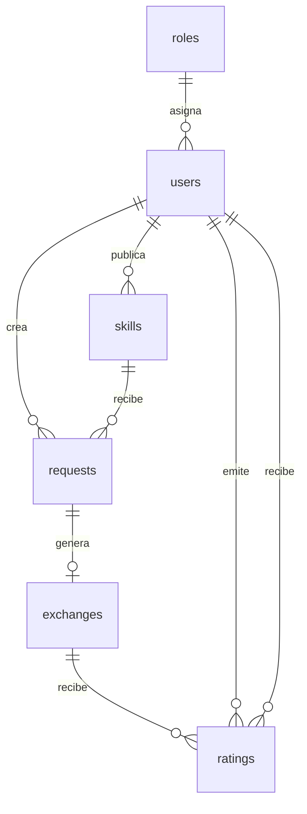
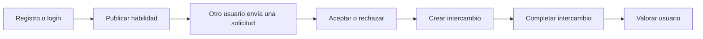

# Memoria técnica — SkillSwap

## 1. Introducción y objetivos

**SkillSwap** es una aplicación web creada para facilitar el intercambio de habilidades técnicas entre usuarios sin necesidad de realizar pagos.

La idea principal es que una persona pueda publicar una habilidad que sabe enseñar, por ejemplo HTML, React o bases de datos, y solicitar ayuda con otra tecnología que quiera aprender.

### Objetivos principales

* Permitir el registro e inicio de sesión de usuarios.
* Publicar, editar y eliminar habilidades.
* Consultar las habilidades disponibles.
* Enviar y gestionar solicitudes de intercambio.
* Crear intercambios a partir de solicitudes aceptadas.
* Valorar a otros usuarios después de completar un intercambio.
* Disponer de un panel de administración.

### Alcance del proyecto

El proyecto incluye frontend, backend y base de datos. También se ha desplegado en internet para poder utilizarlo fuera del entorno local.

---

## 2. Análisis y diseño

### Arquitectura general

SkillSwap utiliza una arquitectura cliente-servidor dividida en tres capas:

```text
Frontend React
      ↓ API REST
Backend Node.js + Express
      ↓ Consultas SQL
Base de datos MySQL
```

El frontend envía peticiones HTTP al backend. El backend procesa la lógica de negocio y consulta la base de datos.

### Modelo Entidad-Relación



### Flujo principal de la aplicación



### Esquema básico de la interfaz (Actualizado)

```text
┌────────────────────────────────────────────────────────┐
│ [Logo] SkillSwap             [ Buscador ]     [Perfil] │
├────────────────────────────────────────────────────────┤
│ [Oscuro] Habilidades  Solicitudes  Intercambios  [ + ] │
├────────────────────────────────────────────────────────┤
│ Pestañas: [Explorar catálogo] [Mis Habilidades]        │
├────────────────────────────────────────────────────────┤
│ Tarjeta de habilidad                                   │
│ Categoría · Nivel                     [Match Flotante] │
│ Título y descripción alineados uniformemente           │
│ Usuario · Formato · Valoración · Fecha · Ubicación     │
│                                            [Solicitar] │
└────────────────────────────────────────────────────────┘
```

---

## 3. Tecnologías utilizadas

### Frontend

* **React:** creación de páginas y componentes reutilizables.
* **Vite:** entorno de desarrollo y compilación.
* **React Router DOM:** navegación entre páginas sin recargar la web.
* **Axios:** comunicación con la API.
* **Context API / AuthContext:** gestión global de la sesión.
* **Tailwind CSS:** estilos, diseño responsive, colores y espaciados.
* **shadcn/ui:** componentes reutilizables como botones, tarjetas, menúes desplegables y pestañas (tabs).
* **Lucide React:** iconos de la interfaz.

### Backend

* **Node.js:** ejecución del servidor.
* **Express:** creación de la API REST.
* **JWT:** autenticación de usuarios.
* **bcrypt:** cifrado de contraseñas.
* **mysql2:** conexión con MySQL.
* **dotenv:** gestión de variables de entorno.
* **CORS:** comunicación entre frontend y backend.

### Base de datos

* **MySQL:** almacenamiento de los datos.
* Tablas principales: `roles`, `users`, `skills`, `requests`, `exchanges` y `ratings`.
* Uso de claves foráneas para mantener las relaciones entre tablas.

### Evolución del Proyecto y Mejoras Recientes

A lo largo del desarrollo, la plataforma ha evolucionado significativamente para ser más accesible, interactiva y atractiva, siguiendo un plan de mejoras enfocado en ampliar el público objetivo y la experiencia de usuario.

**1. Plataforma Multidisciplinar y Logos Generales:**
* Dejamos de ser una plataforma exclusiva de programación para captar un público mucho más amplio (piano, pintura, idiomas, deportes, oficios, etc.).
* Se actualizaron las categorías en la base de datos (`ENUM`) y se implementó un **Selector Dual** en el frontend, permitiendo elegir habilidades predefinidas o añadir nuevas manualmente.
* Los iconos pasaron de ser logos exclusivos de código a usar una librería generalista (Lucide React) que mapea términos de forma inteligente (ej. unas tijeras para peluquería, notas musicales para piano).

**2. Sistema de Match (Conexión Automática):**
* **Flexibilidad en el aprendizaje (`desired_skill_title`):** Se modificó el esquema de la base de datos para que el usuario, desde su onboarding, pueda escribir libremente qué es lo que busca aprender, sin estar restringido a listas cerradas.
* **Algoritmo de Match en el Backend:** Se programó un algoritmo que evalúa la compatibilidad. Si el *Usuario A* ofrece lo que busca el *Usuario B*, y viceversa, se genera una compatibilidad alta.
* **Etiquetas de Compatibilidad Premium:** Se diseñaron etiquetas flotantes con degradados en las tarjetas de habilidad que indican visualmente si existe un "🔥 100% Match" o simplemente "✨ Te interesa", fomentando la interacción rápida.

**3. Chat en Tiempo Real entre Usuarios:**
* Se integró **Socket.io** en el backend (`server.js`) y el frontend (`ChatBox.jsx`).
* Se creó la tabla `messages` en la base de datos para almacenar el historial.
* Ahora, cuando un intercambio es aceptado, los usuarios disponen de un chat bidireccional instantáneo para coordinar sus sesiones directamente desde la plataforma.

**4. Notificaciones Automáticas por Email:**
* Se integró el servicio de correos con `Nodemailer` (`email.service.js` en el backend).
* La plataforma envía alertas por email a los usuarios informándoles cuando reciben una nueva solicitud o cuando un intercambio ha sido aceptado, manteniendo el compromiso de la comunidad sin necesidad de estar siempre conectados.

**5. Ubicación para Modalidades Presenciales:**
* Se añadió soporte completo (columna `location` en BD y campos en formularios) para indicar la ubicación o ciudad en clases presenciales.
* A nivel de diseño UI, esto se adaptó con un sistema de "huecos invisibles" lógicos en las tarjetas (`SkillCards`): si la modalidad es Online, se mantiene la estructura y altura de la tarjeta perfecta sin romper la cuadrícula.

**6. Mejoras Adicionales de UI/UX:**
* **Sistema de Pestañas (Tabs):** Integrado en "Perfil" y "Habilidades" aislando la vista de "Mis Habilidades" para limpiar la pantalla.
* **Navbar Rediseñado (Doble Nivel):** Fila superior limpia (logo y buscador) y fila inferior oscura para navegación principal, dándole un estilo mucho más premium (estilo Amazon).

Estos problemas se resolvieron trabajando por fases y comprobando la experiencia de usuario y funcionalidad tras cada cambio.

---

## 4. Pruebas y despliegue

### Casos de prueba realizados

| Caso de prueba              | Resultado esperado                             |
| --------------------------- | ---------------------------------------------- |
| Registrar usuario           | El usuario se guarda con la contraseña cifrada |
| Iniciar sesión              | El backend devuelve un token JWT               |
| Crear habilidad             | La habilidad aparece en el catálogo            |
| Editar o eliminar habilidad | Solo puede hacerlo su propietario              |
| Enviar solicitud            | Se guarda con estado `open`                    |
| Aceptar solicitud           | Se crea un intercambio                         |
| Completar intercambio       | El estado cambia a `completed`                 |
| Valorar usuario             | Se guarda una puntuación entre 1 y 5           |
| Acceder a administración    | Solo puede acceder un administrador            |
| Bloquear usuario            | El usuario bloqueado no puede iniciar sesión   |

### Despliegue

La aplicación está dividida en tres servicios:

```text
Frontend → Vercel
Backend → Render
Base de datos MySQL → Aiven
```

* **Vercel** compila y publica el frontend desarrollado con Vite.
* **Render** ejecuta el servidor Node.js y Express.
* **Aiven** aloja la base de datos MySQL con conexión SSL.

La comunicación final es:

```text
Usuario
  ↓
Vercel
  ↓
Render
  ↓
Aiven MySQL
```

Las credenciales de la base de datos y el secreto JWT se guardan como variables de entorno y no se publican en GitHub.

---

## Conclusión

SkillSwap ha pasado de ser un MVP básico a una aplicación full stack funcional, prestando **especial atención al diseño UI/UX y la experiencia visual del usuario**.

El proyecto permite completar todo el proceso de un intercambio de habilidades: publicar, solicitar, aceptar, completar y valorar, en un entorno visual pulido, ordenado y escalable.

La separación entre frontend, backend y base de datos facilita el mantenimiento y permite seguir ampliando el proyecto en el futuro. 
