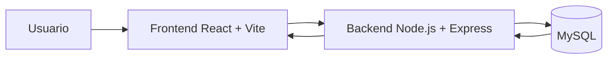

# ARCHITECTURE.md

# Arquitectura de SkillSwap

Este documento es la referencia técnica principal del proyecto. Define qué es SkillSwap, qué arquitectura usa, cómo se organiza el código, cuál es el modelo de datos y qué API debe existir para mantener el proyecto claro.

---

## 1. Resumen del proyecto

**SkillSwap** es una aplicación web de trueque de habilidades técnicas.

La idea principal es que los usuarios puedan:

1. Registrarse.
2. Iniciar sesión.
3. Publicar habilidades que saben hacer.
4. Ver habilidades publicadas por otros usuarios.
5. Solicitar un intercambio de habilidades.
6. Aceptar o rechazar solicitudes.
7. Completar intercambios.
8. Valorar a otros usuarios.

Flujo principal:

```text
Registro → Login → Crear habilidad → Ver habilidades → Solicitar intercambio → Aceptar solicitud → Completar intercambio → Valorar usuario
```

---

## 2. Stack tecnológico base

| Parte | Tecnología |
|---|---|
| Frontend | React + Vite |
| Backend | Node.js + Express |
| Base de datos | MySQL |
| Autenticación | JWT |
| Hash de contraseñas | bcrypt |
| Conexión MySQL | mysql2 |
| Peticiones HTTP | Axios |
| Rutas frontend | React Router DOM |
| Variables de entorno | dotenv |
| Editor recomendado | VS Code |
| Control de versiones | Git + GitHub |

Este stack base ya no debe cambiarse.

No convertir el proyecto a PHP, Laravel, MongoDB, Firebase, Next.js, NestJS o Docker obligatorio salvo que el usuario lo pida expresamente.

---

## 3. Mejora visual para la última fase

Para la **última fase de entrega definitiva**, se añadirá el siguiente stack visual al frontend ya existente:

| Uso | Tecnología |
|---|---|
| Estilos utilitarios | Tailwind CSS |
| Componentes visuales | shadcn/ui |
| Iconos | Lucide React |

Estas tecnologías se añaden para mejorar la interfaz, no para rehacer la arquitectura ni cambiar el flujo funcional ya terminado.

Objetivo de esta fase visual:

- Mejorar el diseño general.
- Ordenar el layout.
- Crear componentes reutilizables.
- Dar aspecto profesional a formularios, tarjetas, botones y navegación.
- Añadir iconos claros para acciones principales.

---

## 4. Arquitectura general

SkillSwap usa una arquitectura **cliente-servidor de 3 capas**:

```text
Usuario
  ↓
Frontend React + Vite
  ↓ HTTP / API REST
Backend Node.js + Express
  ↓ SQL
Base de datos MySQL
```

También puede considerarse una **SPA** porque React permite cambiar de vistas sin recargar toda la página.

---

## 5. Diagrama general



---

## 6. Responsabilidad de cada capa

## Frontend

El frontend es la parte visual que utiliza el usuario desde el navegador.

Responsabilidades:

- Mostrar páginas.
- Gestionar formularios.
- Enviar peticiones HTTP al backend.
- Guardar el token JWT en `localStorage`.
- Añadir el token a las peticiones protegidas.
- Mostrar mensajes de error y éxito.
- Permitir registro, login, publicación de habilidades, solicitudes, intercambios y valoraciones.
- En la última fase, mejorar la interfaz con Tailwind CSS, shadcn/ui y Lucide React.

## Backend

El backend contiene la lógica de negocio y protege los datos.

Responsabilidades:

- Registrar usuarios.
- Iniciar sesión.
- Cifrar contraseñas con `bcrypt`.
- Generar tokens JWT.
- Verificar tokens JWT.
- Proteger rutas privadas.
- Conectar con MySQL.
- Crear, listar, editar y eliminar habilidades.
- Crear, aceptar y rechazar solicitudes.
- Gestionar intercambios.
- Registrar valoraciones.
- Aplicar reglas de negocio.

## Base de datos

La base de datos guarda la información permanente.

Motor:

```text
MySQL
```

Nombre recomendado:

```text
skillswap_db
```

---

## 7. Estructura recomendada del proyecto

```text
SkillSwap/
├── backend/
│   ├── package.json
│   ├── .env
│   └── src/
│       ├── app.js
│       ├── server.js
│       ├── routes/
│       ├── controllers/
│       ├── models/
│       ├── middleware/
│       └── config/
│
├── frontend/
│   ├── package.json
│   ├── .env
│   ├── vite.config.js
│   └── src/
│       ├── main.jsx
│       ├── App.jsx
│       ├── index.css
│       ├── pages/
│       ├── components/
│       │   ├── layout/
│       │   ├── skills/
│       │   └── ui/
│       ├── services/
│       ├── context/
│       └── lib/
│
├── database/
│   └── skillswap.sql
│
└── docs/
    ├── ARCHITECTURE.md
    ├── IA_CONTEXT.md
    └── ROADMAP.md
```

La carpeta `frontend/src/components/ui` se usará para los componentes de shadcn/ui en la última fase visual.

---

## 8. Pasos técnicos para añadir Tailwind CSS, shadcn/ui y Lucide React

Estos pasos se ejecutan dentro de `frontend`.

```bash
cd frontend
```

### 8.1 Instalar Tailwind CSS con Vite

```bash
npm install tailwindcss @tailwindcss/vite
```

Actualizar `frontend/vite.config.js`:

```js
import { defineConfig } from "vite"
import react from "@vitejs/plugin-react"
import tailwindcss from "@tailwindcss/vite"
import path from "path"

export default defineConfig({
  plugins: [react(), tailwindcss()],
  resolve: {
    alias: {
      "@": path.resolve(__dirname, "./src"),
    },
  },
})
```

Actualizar `frontend/src/index.css`:

```css
@import "tailwindcss";
```

### 8.2 Configurar alias `@`

Crear o revisar `frontend/jsconfig.json`:

```json
{
  "compilerOptions": {
    "baseUrl": ".",
    "paths": {
      "@/*": ["./src/*"]
    }
  }
}
```

Instalar tipos de Node si Vite necesita resolver `path`:

```bash
npm install -D @types/node
```

### 8.3 Inicializar shadcn/ui

```bash
npx shadcn@latest init
```

Opciones recomendadas:

```text
Style: New York o Default
Base color: Neutral o Slate
CSS file: src/index.css
Components: src/components/ui
Utils: src/lib/utils.js
React Server Components: No
```

Componentes recomendados para la entrega definitiva:

```bash
npx shadcn@latest add button card input label textarea badge dialog dropdown-menu select avatar separator skeleton alert
```

### 8.4 Instalar Lucide React

```bash
npm install lucide-react
```

Ejemplo de uso:

```jsx
import { Search, Plus, User, LogOut, BookOpen, Handshake, Star } from "lucide-react"

export function ExampleIcon() {
  return <Search className="h-4 w-4" />
}
```

---

## 9. Uso recomendado en la última fase visual

## Tailwind CSS

Usar para:

- Layout.
- Espaciados.
- Responsive.
- Colores.
- Bordes.
- Sombras.
- Estados `hover`, `focus`, `disabled`.

## shadcn/ui

Usar para:

- Botones.
- Inputs.
- Labels.
- Textareas.
- Cards.
- Badges.
- Dialogs.
- Dropdowns.
- Selects.
- Alerts.
- Skeletons.

## Lucide React

Usar para iconos de:

- Inicio.
- Habilidades.
- Solicitudes.
- Intercambios.
- Valoraciones.
- Perfil.
- Editar.
- Eliminar.
- Buscar.
- Cerrar sesión.

---

## 10. API REST principal

## Auth

| Método | Endpoint | Descripción | Protegida |
|---|---|---|---|
| POST | `/api/auth/register` | Registrar usuario | No |
| POST | `/api/auth/login` | Iniciar sesión y devolver JWT | No |
| GET | `/api/users/me` | Obtener usuario actual | Sí |

## Skills

| Método | Endpoint | Descripción | Protegida |
|---|---|---|---|
| GET | `/api/skills` | Listar habilidades | No |
| GET | `/api/skills/:id` | Ver detalle de habilidad | No |
| POST | `/api/skills` | Crear habilidad | Sí |
| PUT | `/api/skills/:id` | Editar habilidad propia | Sí |
| DELETE | `/api/skills/:id` | Eliminar habilidad propia | Sí |

## Requests

| Método | Endpoint | Descripción | Protegida |
|---|---|---|---|
| POST | `/api/requests` | Crear solicitud de intercambio | Sí |
| GET | `/api/requests` | Ver solicitudes del usuario | Sí |
| PUT | `/api/requests/:id/accept` | Aceptar solicitud recibida | Sí |
| PUT | `/api/requests/:id/reject` | Rechazar solicitud recibida | Sí |

## Exchanges

| Método | Endpoint | Descripción | Protegida |
|---|---|---|---|
| GET | `/api/exchanges` | Ver intercambios del usuario | Sí |
| POST | `/api/exchanges` | Crear intercambio desde solicitud aceptada | Sí |
| PUT | `/api/exchanges/:id/complete` | Marcar intercambio como completado | Sí |

## Ratings

| Método | Endpoint | Descripción | Protegida |
|---|---|---|---|
| POST | `/api/ratings` | Valorar usuario después de intercambio | Sí |
| GET | `/api/users/:id/ratings` | Ver valoraciones de usuario | No |

---

## 11. Modelo relacional

Entidades completas del proyecto:

```text
roles
users
skills
requests
exchanges
ratings
```

---

## 12. Reglas de negocio

- Un usuario debe estar registrado para iniciar sesión.
- Un usuario debe estar logueado para crear habilidades.
- Un usuario debe estar logueado para crear solicitudes.
- Un usuario no puede solicitar una habilidad que él mismo publicó.
- Una habilidad pertenece a un solo usuario.
- Una habilidad puede recibir muchas solicitudes.
- Una solicitud aceptada puede generar un único intercambio.
- Solo se crea un `exchange` cuando una `request` está aceptada.
- Una valoración solo se puede registrar cuando un intercambio está completado.
- Un usuario no puede valorarse a sí mismo.
- Un usuario solo puede valorar una vez por cada intercambio.

---

## 13. Seguridad mínima

- Guardar contraseñas con `bcrypt`.
- No devolver `password` en respuestas JSON.
- Usar JWT en rutas privadas.
- Enviar token como `Authorization: Bearer TOKEN`.
- Usar consultas SQL preparadas.
- Validar campos obligatorios.
- Guardar secretos en `.env`.
- Configurar CORS para el frontend de Vite.

---

## 14. Variables de entorno

Backend:

```env
PORT=3000
DB_HOST=localhost
DB_USER=root
DB_PASSWORD=
DB_NAME=skillswap_db
JWT_SECRET=skillswap_secret_dev
```

Frontend:

```env
VITE_API_URL=http://localhost:3000/api
```

---

## 15. Puertos de desarrollo

```text
Frontend: http://localhost:5173
Backend:  http://localhost:3000
MySQL:    localhost:3306
```

---

## 16. Criterio técnico principal

La arquitectura funcional ya está definida. En la última fase no se debe rehacer el proyecto: solo integrar Tailwind CSS, shadcn/ui y Lucide React para mejorar la presentación final.
