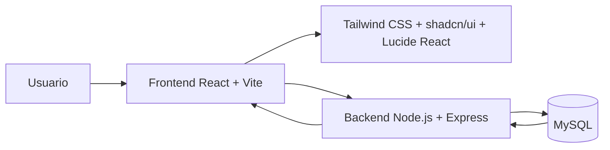
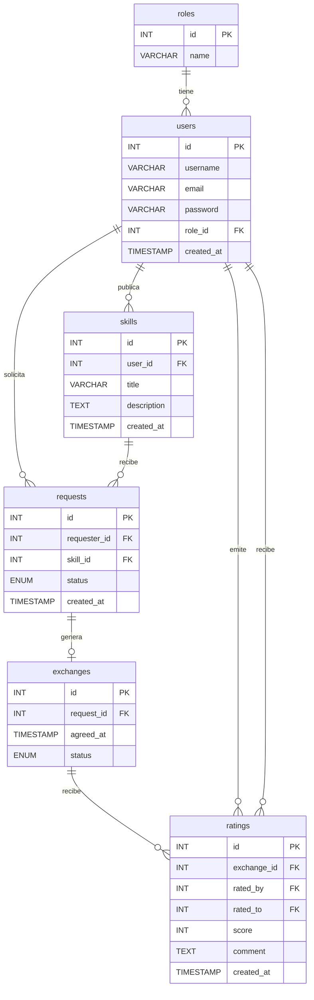

# ARCHITECTURE.md

# Arquitectura de SkillSwap

Este documento es la referencia técnica principal del proyecto. Define qué es SkillSwap, qué arquitectura usa, cómo se organiza el código, qué tecnologías forman parte del stack oficial y qué estructura debe seguir el frontend, backend y base de datos.

---

## 1. Resumen del proyecto

**SkillSwap** es una aplicación web de trueque de habilidades técnicas.

La idea principal es que los usuarios puedan:

1. Registrarse.
2. Iniciar sesión.
3. Publicar habilidades que saben hacer.
4. Ver habilidades publicadas por otros usuarios.
5. Solicitar un intercambio de habilidades.
6. Aceptar o rechazar solicitudes.
7. Finalizar intercambios.
8. Valorar a otros usuarios en la fase final.

Ejemplo:

- Un usuario ofrece enseñar HTML y CSS.
- Otro usuario ofrece enseñar JavaScript.
- Ambos pueden acordar un intercambio de conocimientos sin pago directo.

Flujo mínimo del MVP:

```text
Registro → Login → Crear habilidad → Ver habilidades → Solicitar intercambio
```

Flujo esperado para entrega final:

```text
Registro → Login → Crear habilidad → Solicitar intercambio → Aceptar solicitud → Completar intercambio → Valorar usuario
```

---

## 2. Stack tecnológico oficial

| Parte | Tecnología |
|---|---|
| Frontend | React + Vite |
| Estilos | Tailwind CSS |
| Componentes UI | shadcn/ui |
| Iconos | Lucide React |
| Backend | Node.js + Express |
| Base de datos | MySQL |
| Autenticación | JWT |
| Hash de contraseñas | bcrypt |
| Conexión MySQL | mysql2 |
| Peticiones HTTP | Axios |
| Rutas frontend | React Router DOM |
| Variables de entorno | dotenv |
| Editor recomendado | VS Code |
| Control de versiones | Git + GitHub |

El stack oficial para este proyecto es:

```text
React + Vite + Tailwind CSS + shadcn/ui + Lucide React
Node.js + Express
MySQL
```

No cambiar a PHP, Laravel, MongoDB, Firebase, Next.js, NestJS o Docker obligatorio salvo que el usuario lo pida expresamente.

---

## 3. Arquitectura general

SkillSwap usa una arquitectura **cliente-servidor de 3 capas**:

```text
Usuario
  ↓
Frontend React + Vite + Tailwind + shadcn/ui + Lucide React
  ↓ HTTP / API REST
Backend Node.js + Express
  ↓ SQL
Base de datos MySQL
```

También puede considerarse una **SPA** porque React permite cambiar de vistas sin recargar toda la página.

---

## 4. Diagrama general



---

## 5. Responsabilidad de cada capa

## Frontend

El frontend es la parte visual que utiliza el usuario desde el navegador.

Responsabilidades:

- Mostrar páginas.
- Gestionar formularios.
- Enviar peticiones HTTP al backend.
- Guardar el token JWT en `localStorage`.
- Añadir el token a las peticiones protegidas.
- Mostrar mensajes de error y éxito.
- Permitir registro, login, publicación de habilidades y solicitudes.
- Usar Tailwind CSS para layout, espaciado, colores y responsive.
- Usar shadcn/ui para componentes visuales reutilizables.
- Usar Lucide React para iconos claros y consistentes.

Tecnologías principales:

- React.
- Vite.
- Tailwind CSS.
- shadcn/ui.
- Lucide React.
- Axios.
- React Router DOM.

## Backend

El backend contiene la lógica de negocio y protege los datos.

Responsabilidades:

- Registrar usuarios.
- Iniciar sesión.
- Cifrar contraseñas con `bcrypt`.
- Generar tokens JWT.
- Verificar tokens JWT.
- Proteger rutas privadas.
- Conectar con MySQL.
- Crear, listar, editar y eliminar habilidades.
- Crear, aceptar y rechazar solicitudes de intercambio.
- Crear intercambios aceptados.
- Registrar valoraciones en la fase final.
- Aplicar reglas de negocio.

Tecnologías principales:

- Node.js.
- Express.
- mysql2.
- bcrypt.
- jsonwebtoken.
- dotenv.
- cors.

## Base de datos

La base de datos guarda la información permanente.

Motor:

```text
MySQL
```

Nombre recomendado:

```text
skillswap_db
```

---

## 6. Estructura recomendada del proyecto

```text
SkillSwap/
├── backend/
│   ├── package.json
│   ├── .env
│   └── src/
│       ├── app.js
│       ├── server.js
│       ├── routes/
│       │   ├── auth.routes.js
│       │   ├── users.routes.js
│       │   ├── skills.routes.js
│       │   ├── requests.routes.js
│       │   ├── exchanges.routes.js
│       │   └── ratings.routes.js
│       ├── controllers/
│       │   ├── auth.controller.js
│       │   ├── users.controller.js
│       │   ├── skills.controller.js
│       │   ├── requests.controller.js
│       │   ├── exchanges.controller.js
│       │   └── ratings.controller.js
│       ├── models/
│       │   ├── user.model.js
│       │   ├── skill.model.js
│       │   ├── request.model.js
│       │   ├── exchange.model.js
│       │   └── rating.model.js
│       ├── middleware/
│       │   └── auth.middleware.js
│       └── config/
│           └── db.js
│
├── frontend/
│   ├── package.json
│   ├── .env
│   ├── vite.config.js
│   ├── jsconfig.json
│   ├── components.json
│   └── src/
│       ├── main.jsx
│       ├── App.jsx
│       ├── index.css
│       ├── pages/
│       │   ├── HomePage.jsx
│       │   ├── LoginPage.jsx
│       │   ├── RegisterPage.jsx
│       │   ├── DashboardPage.jsx
│       │   ├── SkillsPage.jsx
│       │   ├── SkillDetailPage.jsx
│       │   ├── MyRequestsPage.jsx
│       │   ├── ExchangesPage.jsx
│       │   └── ProfilePage.jsx
│       ├── components/
│       │   ├── layout/
│       │   │   └── Navbar.jsx
│       │   ├── skills/
│       │   │   ├── SkillCard.jsx
│       │   │   └── SkillForm.jsx
│       │   └── ui/
│       │       └── componentes de shadcn/ui
│       ├── services/
│       │   ├── api.js
│       │   ├── authService.js
│       │   ├── skillsService.js
│       │   ├── requestsService.js
│       │   ├── exchangesService.js
│       │   └── ratingsService.js
│       ├── context/
│       │   └── AuthContext.jsx
│       ├── lib/
│       │   └── utils.js
│       └── styles/
│           └── opcional si se necesitan estilos separados
│
├── database/
│   └── skillswap.sql
│
└── docs/
    ├── ARCHITECTURE.md
    ├── IA_CONTEXT.md
    └── ROADMAP.md
```

---

## 7. Instalación del stack visual del frontend

Estos pasos se ejecutan dentro de la carpeta `frontend`.

```bash
cd frontend
```

### 7.1 Instalar Tailwind CSS con Vite

```bash
npm install tailwindcss @tailwindcss/vite
```

Actualizar `frontend/vite.config.js`:

```js
import { defineConfig } from "vite"
import react from "@vitejs/plugin-react"
import tailwindcss from "@tailwindcss/vite"
import path from "path"

export default defineConfig({
  plugins: [react(), tailwindcss()],
  resolve: {
    alias: {
      "@": path.resolve(__dirname, "./src"),
    },
  },
})
```

Actualizar `frontend/src/index.css`:

```css
@import "tailwindcss";
```

### 7.2 Configurar alias `@`

Crear `frontend/jsconfig.json` si el proyecto usa JavaScript:

```json
{
  "compilerOptions": {
    "baseUrl": ".",
    "paths": {
      "@/*": ["./src/*"]
    }
  }
}
```

Instalar tipos de Node para que Vite resuelva `path` correctamente:

```bash
npm install -D @types/node
```

### 7.3 Instalar shadcn/ui

Inicializar shadcn/ui:

```bash
npx shadcn@latest init
```

Opciones recomendadas para este proyecto:

```text
Style: New York o Default
Base color: Neutral o Slate
CSS file: src/index.css
Components: src/components/ui
Utils: src/lib/utils.js
React Server Components: No
```

Componentes recomendados para comenzar:

```bash
npx shadcn@latest add button card input label textarea badge dialog dropdown-menu select avatar separator skeleton alert
```

Uso esperado:

```jsx
import { Button } from "@/components/ui/button"

export function ExampleButton() {
  return <Button>Publicar habilidad</Button>
}
```

### 7.4 Instalar Lucide React

```bash
npm install lucide-react
```

Uso esperado:

```jsx
import { Search, Plus, User, LogOut } from "lucide-react"

export function ExampleIcon() {
  return <Search className="h-4 w-4" />
}
```

---

## 8. Uso recomendado de Tailwind CSS

Tailwind debe usarse para:

- Layout general.
- Espaciados.
- Responsive.
- Colores.
- Bordes.
- Sombras.
- Estados `hover`, `focus`, `disabled`.

Ejemplo:

```jsx
<div className="mx-auto max-w-6xl px-4 py-8">
  <h1 className="text-3xl font-bold tracking-tight">SkillSwap</h1>
</div>
```

---

## 9. Uso recomendado de shadcn/ui

shadcn/ui debe usarse para componentes base:

- Botones.
- Inputs.
- Labels.
- Cards.
- Textareas.
- Badges.
- Dialogs.
- Selects.
- Skeletons.
- Alerts.

Ejemplo para tarjetas de habilidades:

```jsx
import { Card, CardContent, CardHeader, CardTitle } from "@/components/ui/card"
import { Badge } from "@/components/ui/badge"

export function SkillCard({ skill }) {
  return (
    <Card>
      <CardHeader>
        <CardTitle>{skill.title}</CardTitle>
      </CardHeader>
      <CardContent>
        <p>{skill.description}</p>
        <Badge>{skill.status || "Disponible"}</Badge>
      </CardContent>
    </Card>
  )
}
```

---

## 10. Uso recomendado de Lucide React

Lucide React debe usarse para iconos de navegación, acciones y estados.

Iconos sugeridos:

| Uso | Icono |
|---|---|
| Buscar | `Search` |
| Crear | `Plus` |
| Usuario | `User` |
| Logout | `LogOut` |
| Habilidades | `BookOpen` |
| Solicitudes | `Handshake` |
| Intercambios | `RefreshCcw` |
| Valoraciones | `Star` |
| Editar | `Pencil` |
| Eliminar | `Trash2` |

Ejemplo:

```jsx
import { BookOpen } from "lucide-react"

export function SkillsTitle() {
  return (
    <div className="flex items-center gap-2">
      <BookOpen className="h-5 w-5" />
      <h2 className="text-xl font-semibold">Habilidades</h2>
    </div>
  )
}
```

---

## 11. API REST mínima

## Auth

| Método | Endpoint | Descripción | Protegida |
|---|---|---|---|
| POST | `/api/auth/register` | Registrar usuario | No |
| POST | `/api/auth/login` | Iniciar sesión y devolver JWT | No |
| GET | `/api/users/me` | Obtener usuario actual | Sí |

## Skills

| Método | Endpoint | Descripción | Protegida |
|---|---|---|---|
| GET | `/api/skills` | Listar habilidades | No |
| GET | `/api/skills/:id` | Ver detalle de habilidad | No |
| POST | `/api/skills` | Crear habilidad | Sí |
| PUT | `/api/skills/:id` | Editar habilidad propia | Sí |
| DELETE | `/api/skills/:id` | Eliminar habilidad propia | Sí |

## Requests

| Método | Endpoint | Descripción | Protegida |
|---|---|---|---|
| POST | `/api/requests` | Crear solicitud de intercambio | Sí |
| GET | `/api/requests` | Ver solicitudes del usuario | Sí |
| PUT | `/api/requests/:id/accept` | Aceptar solicitud recibida | Sí |
| PUT | `/api/requests/:id/reject` | Rechazar solicitud recibida | Sí |

## Exchanges

| Método | Endpoint | Descripción | Protegida |
|---|---|---|---|
| GET | `/api/exchanges` | Ver intercambios del usuario | Sí |
| POST | `/api/exchanges` | Crear intercambio desde solicitud aceptada | Sí |
| PUT | `/api/exchanges/:id/complete` | Marcar intercambio como completado | Sí |

## Ratings

| Método | Endpoint | Descripción | Protegida |
|---|---|---|---|
| POST | `/api/ratings` | Valorar usuario después de intercambio | Sí |
| GET | `/api/users/:id/ratings` | Ver valoraciones de usuario | No |

---

## 12. Modelo relacional

Entidades completas del proyecto:

```text
roles
users
skills
requests
exchanges
ratings
```

Para la entrega final deben estar implementadas:

```text
roles
users
skills
requests
exchanges
ratings
```

---

## 13. Diagrama ER



---

## 14. Reglas de negocio

- Un usuario debe estar registrado para iniciar sesión.
- Un usuario debe estar logueado para crear habilidades.
- Un usuario debe estar logueado para crear solicitudes.
- Un usuario no puede solicitar una habilidad que él mismo publicó.
- Una habilidad pertenece a un solo usuario.
- Una habilidad puede recibir muchas solicitudes.
- Una solicitud aceptada puede generar un único intercambio.
- Solo se crea un `exchange` cuando una `request` está aceptada.
- Una valoración solo se puede registrar cuando un intercambio está completado.
- Un usuario no puede valorarse a sí mismo.
- Un usuario solo puede valorar una vez por cada intercambio.

---

## 15. Seguridad mínima

- Guardar contraseñas con `bcrypt`.
- No devolver `password` en respuestas JSON.
- Usar JWT en rutas privadas.
- Enviar token como `Authorization: Bearer TOKEN`.
- Usar consultas SQL preparadas.
- Validar campos obligatorios.
- Guardar secretos en `.env`.
- Configurar CORS para el frontend de Vite.

---

## 16. Variables de entorno

Backend:

```env
PORT=3000
DB_HOST=localhost
DB_USER=root
DB_PASSWORD=
DB_NAME=skillswap_db
JWT_SECRET=skillswap_secret_dev
```

Frontend:

```env
VITE_API_URL=http://localhost:3000/api
```

---

## 17. Puertos de desarrollo

```text
Frontend: http://localhost:5173
Backend:  http://localhost:3000
MySQL:    localhost:3306
```

---

## 18. Referencias oficiales del stack visual

- Tailwind CSS con Vite: https://tailwindcss.com/docs/installation/using-vite
- shadcn/ui con Vite: https://ui.shadcn.com/docs/installation/vite
- Lucide React: https://lucide.dev/guide/react

---

## 19. Criterio técnico principal

La arquitectura debe permitir empezar rápido, mantener el código ordenado y ampliar el proyecto después sin rehacerlo desde cero.

Prioridad:

```text
Primero MVP funcional. Después entrega final completa.
```
