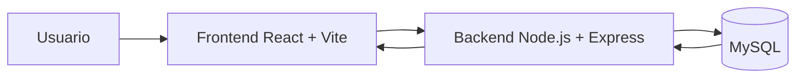
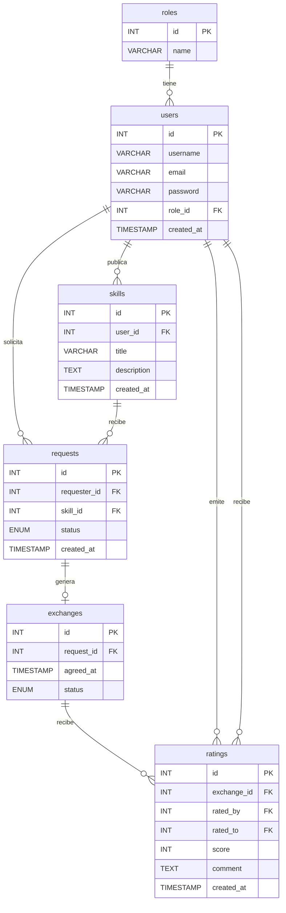

# ARCHITECTURE.md

# Arquitectura de SkillSwap

Este documento es la referencia técnica principal del proyecto. Aquí se define qué es SkillSwap, qué arquitectura usa, cómo se organiza el código, cuál es el modelo de datos y qué API mínima debe existir para comenzar el desarrollo.

---

## 1. Resumen del proyecto

**SkillSwap** es una aplicación web de trueque de habilidades técnicas.

La idea principal es que los usuarios puedan:

1. Registrarse.
2. Iniciar sesión.
3. Publicar habilidades que saben hacer.
4. Ver habilidades publicadas por otros usuarios.
5. Solicitar un intercambio de habilidades.

Ejemplo:

- Un usuario ofrece enseñar HTML y CSS.
- Otro usuario ofrece enseñar JavaScript.
- Ambos pueden acordar un intercambio de conocimientos sin pago directo.

Flujo mínimo del MVP:

```text
Registro → Login → Crear habilidad → Ver habilidades → Solicitar intercambio
```

---

## 2. Stack tecnológico oficial

| Parte | Tecnología |
|---|---|
| Frontend | React + Vite |
| Backend | Node.js + Express |
| Base de datos | MySQL |
| Autenticación | JWT |
| Hash de contraseñas | bcrypt |
| Conexión MySQL | mysql2 |
| Peticiones HTTP | Axios |
| Rutas frontend | React Router DOM |
| Variables de entorno | dotenv |
| Editor recomendado | VS Code |
| Control de versiones | Git + GitHub |

El stack oficial para este proyecto es **React + Vite, Node.js + Express y MySQL**.

No cambiar a PHP, Laravel, MongoDB, Firebase, Next.js, NestJS o Docker obligatorio salvo que el usuario lo pida expresamente.

---

## 3. Tipo de arquitectura

SkillSwap usa una arquitectura **cliente-servidor de 3 capas**:

```text
Usuario
  ↓
Frontend React + Vite
  ↓ HTTP / API REST
Backend Node.js + Express
  ↓ SQL
Base de datos MySQL
```

También puede considerarse una **SPA** porque React permite cambiar de vistas sin recargar toda la página.

---

## 4. Diagrama general



---

## 5. Responsabilidad de cada capa

## Frontend

El frontend es la parte visual que utiliza el usuario desde el navegador.

Responsabilidades:

- Mostrar páginas.
- Gestionar formularios.
- Enviar peticiones HTTP al backend.
- Guardar el token JWT en `localStorage`.
- Añadir el token a las peticiones protegidas.
- Mostrar mensajes de error y éxito.
- Permitir registro, login, publicación de habilidades y solicitudes.

Tecnologías principales:

- React.
- Vite.
- Axios.
- React Router DOM.
- CSS.

## Backend

El backend contiene la lógica de negocio y protege los datos.

Responsabilidades:

- Registrar usuarios.
- Iniciar sesión.
- Cifrar contraseñas con `bcrypt`.
- Generar tokens JWT.
- Verificar tokens JWT.
- Proteger rutas privadas.
- Conectar con MySQL.
- Crear y listar habilidades.
- Crear solicitudes de intercambio.
- Aplicar reglas de negocio.

Tecnologías principales:

- Node.js.
- Express.
- mysql2.
- bcrypt.
- jsonwebtoken.
- dotenv.
- cors.

## Base de datos

La base de datos guarda la información permanente.

Motor:

```text
MySQL
```

Nombre recomendado:

```text
skillswap_db
```

---

## 6. Estructura recomendada del proyecto

```text
SkillSwap/
├── backend/
│   ├── package.json
│   ├── .env
│   └── src/
│       ├── app.js
│       ├── server.js
│       ├── routes/
│       │   ├── auth.routes.js
│       │   ├── users.routes.js
│       │   ├── skills.routes.js
│       │   └── requests.routes.js
│       ├── controllers/
│       │   ├── auth.controller.js
│       │   ├── users.controller.js
│       │   ├── skills.controller.js
│       │   └── requests.controller.js
│       ├── models/
│       │   ├── user.model.js
│       │   ├── skill.model.js
│       │   └── request.model.js
│       ├── middleware/
│       │   └── auth.middleware.js
│       └── config/
│           └── db.js
│
├── frontend/
│   ├── package.json
│   ├── .env
│   └── src/
│       ├── main.jsx
│       ├── App.jsx
│       ├── pages/
│       │   ├── LoginPage.jsx
│       │   ├── RegisterPage.jsx
│       │   ├── DashboardPage.jsx
│       │   └── SkillsPage.jsx
│       ├── components/
│       │   ├── Navbar.jsx
│       │   └── SkillCard.jsx
│       ├── services/
│       │   ├── api.js
│       │   ├── authService.js
│       │   ├── skillsService.js
│       │   └── requestsService.js
│       ├── context/
│       │   └── AuthContext.jsx
│       └── styles/
│           └── global.css
│
├── database/
│   └── skillswap.sql
│
├── ARCHITECTURE.md
├── IA_CONTEXT.md
└── ROADMAP.md
```

---

## 7. Backend: detalle de carpetas

### `backend/src/app.js`

Configura Express:

- `express.json()`.
- `cors()`.
- Rutas principales.
- Ruta de prueba `/api/health`.
- Manejo básico de errores.

### `backend/src/server.js`

Arranca el servidor.

Puerto recomendado:

```text
3000
```

### `backend/src/config/db.js`

Crea la conexión a MySQL usando `mysql2/promise`.

Debe leer las variables desde `.env`.

### `backend/src/routes`

Define las rutas HTTP.

Archivos mínimos:

- `auth.routes.js`
- `users.routes.js`
- `skills.routes.js`
- `requests.routes.js`

### `backend/src/controllers`

Contiene la lógica de cada endpoint:

- Validar datos recibidos.
- Llamar al modelo correspondiente.
- Aplicar reglas de negocio.
- Devolver respuesta JSON.

### `backend/src/models`

Contiene las consultas SQL.

Regla obligatoria:

```text
Usar consultas preparadas. No concatenar SQL con datos del usuario.
```

### `backend/src/middleware`

Contiene middlewares.

El principal es:

```text
auth.middleware.js
```

Sirve para verificar JWT y proteger rutas privadas.

---

## 8. Frontend: detalle de carpetas

### `frontend/src/pages`

Pantallas principales:

- `LoginPage.jsx`
- `RegisterPage.jsx`
- `DashboardPage.jsx`
- `SkillsPage.jsx`

### `frontend/src/components`

Componentes reutilizables:

- `Navbar.jsx`
- `SkillCard.jsx`

### `frontend/src/services`

Archivos para llamar al backend:

- `api.js`: instancia de Axios con URL base.
- `authService.js`: registro, login y usuario actual.
- `skillsService.js`: listar y crear habilidades.
- `requestsService.js`: crear y listar solicitudes.

### `frontend/src/context`

Estado global de sesión:

- `AuthContext.jsx`

### `frontend/src/styles`

Estilos globales:

- `global.css`

---

## 9. API REST mínima

## Auth

| Método | Endpoint | Descripción | Protegida |
|---|---|---|---|
| POST | `/api/auth/register` | Registrar usuario | No |
| POST | `/api/auth/login` | Iniciar sesión y devolver JWT | No |
| GET | `/api/users/me` | Obtener usuario actual | Sí |

## Skills

| Método | Endpoint | Descripción | Protegida |
|---|---|---|---|
| GET | `/api/skills` | Listar habilidades | No |
| GET | `/api/skills/:id` | Ver detalle de habilidad | No |
| POST | `/api/skills` | Crear habilidad | Sí |
| PUT | `/api/skills/:id` | Editar habilidad propia | Sí, opcional |
| DELETE | `/api/skills/:id` | Eliminar habilidad propia | Sí, opcional |

## Requests

| Método | Endpoint | Descripción | Protegida |
|---|---|---|---|
| POST | `/api/requests` | Crear solicitud de intercambio | Sí |
| GET | `/api/requests` | Ver solicitudes del usuario | Sí |

## Exchanges, opcional para fase posterior

| Método | Endpoint | Descripción | Protegida |
|---|---|---|---|
| POST | `/api/exchanges` | Crear intercambio desde solicitud aceptada | Sí |

---

## 10. Modelo relacional

Entidades completas del proyecto:

```text
roles
users
skills
requests
exchanges
ratings
```

Para la primera entrega son obligatorias:

```text
roles
users
skills
requests
```

Opcional si hay tiempo:

```text
exchanges
```

Para fase final:

```text
ratings
```

---

## 11. Diagrama ER



---

## 12. Tablas principales

## `roles`

```text
id
name
```

Roles iniciales:

```text
admin
user
```

## `users`

```text
id
username
email
password
role_id
created_at
```

Notas:

- `username` debe ser único.
- `email` debe ser único.
- `password` guarda hash con `bcrypt`.
- `role_id` apunta a `roles.id`.

## `skills`

```text
id
user_id
title
description
created_at
```

Notas:

- Cada habilidad pertenece a un usuario.
- `user_id` viene del usuario autenticado.

## `requests`

```text
id
requester_id
skill_id
status
created_at
```

Estados:

```text
open
accepted
rejected
```

Notas:

- `requester_id` viene del usuario autenticado.
- `skill_id` apunta a la habilidad solicitada.
- Un usuario no puede solicitar su propia habilidad.

## `exchanges`

```text
id
request_id
agreed_at
status
```

Estados:

```text
pending
completed
cancelled
```

Notas:

- Una `request` aceptada genera como máximo un `exchange`.
- `exchanges.request_id` debe ser `UNIQUE`.

## `ratings`

```text
id
exchange_id
rated_by
rated_to
score
comment
created_at
```

Notas:

- Un intercambio puede tener varias valoraciones.
- `rated_by` indica quién valora.
- `rated_to` indica quién recibe la valoración.
- Un usuario no puede valorarse a sí mismo.
- Un usuario solo puede valorar una vez por intercambio.

---

## 13. SQL mínimo para empezar

```sql
CREATE DATABASE IF NOT EXISTS skillswap_db
CHARACTER SET utf8mb4
COLLATE utf8mb4_unicode_ci;

USE skillswap_db;

CREATE TABLE roles (
  id INT AUTO_INCREMENT PRIMARY KEY,
  name VARCHAR(50) NOT NULL UNIQUE
);

CREATE TABLE users (
  id INT AUTO_INCREMENT PRIMARY KEY,
  username VARCHAR(100) NOT NULL UNIQUE,
  email VARCHAR(150) NOT NULL UNIQUE,
  password VARCHAR(255) NOT NULL,
  role_id INT NOT NULL DEFAULT 2,
  created_at TIMESTAMP DEFAULT CURRENT_TIMESTAMP,
  FOREIGN KEY (role_id) REFERENCES roles(id)
);

CREATE TABLE skills (
  id INT AUTO_INCREMENT PRIMARY KEY,
  user_id INT NOT NULL,
  title VARCHAR(150) NOT NULL,
  description TEXT,
  created_at TIMESTAMP DEFAULT CURRENT_TIMESTAMP,
  FOREIGN KEY (user_id) REFERENCES users(id) ON DELETE CASCADE
);

CREATE TABLE requests (
  id INT AUTO_INCREMENT PRIMARY KEY,
  requester_id INT NOT NULL,
  skill_id INT NOT NULL,
  status ENUM('open','accepted','rejected') DEFAULT 'open',
  created_at TIMESTAMP DEFAULT CURRENT_TIMESTAMP,
  FOREIGN KEY (requester_id) REFERENCES users(id) ON DELETE CASCADE,
  FOREIGN KEY (skill_id) REFERENCES skills(id) ON DELETE CASCADE
);

INSERT INTO roles (name) VALUES ('admin'), ('user');
```

---

## 14. SQL completo para fase posterior

```sql
CREATE TABLE exchanges (
  id INT AUTO_INCREMENT PRIMARY KEY,
  request_id INT NOT NULL UNIQUE,
  agreed_at TIMESTAMP NULL,
  status ENUM('pending','completed','cancelled') DEFAULT 'pending',
  FOREIGN KEY (request_id) REFERENCES requests(id) ON DELETE CASCADE ON UPDATE CASCADE
);

CREATE TABLE ratings (
  id INT AUTO_INCREMENT PRIMARY KEY,
  exchange_id INT NOT NULL,
  rated_by INT NOT NULL,
  rated_to INT NOT NULL,
  score INT NOT NULL,
  comment TEXT,
  created_at TIMESTAMP DEFAULT CURRENT_TIMESTAMP,
  FOREIGN KEY (exchange_id) REFERENCES exchanges(id) ON DELETE CASCADE ON UPDATE CASCADE,
  FOREIGN KEY (rated_by) REFERENCES users(id) ON DELETE CASCADE ON UPDATE CASCADE,
  FOREIGN KEY (rated_to) REFERENCES users(id) ON DELETE CASCADE ON UPDATE CASCADE,
  CONSTRAINT check_score CHECK (score BETWEEN 1 AND 5),
  CONSTRAINT check_rated_users CHECK (rated_by <> rated_to),
  UNIQUE KEY uq_rating_exchange_user (exchange_id, rated_by)
);
```

---

## 15. Reglas de negocio

- Un usuario debe estar registrado para iniciar sesión.
- Un usuario debe estar logueado para crear habilidades.
- Un usuario debe estar logueado para crear solicitudes.
- Un usuario no puede solicitar una habilidad que él mismo publicó.
- Una habilidad pertenece a un solo usuario.
- Una habilidad puede recibir muchas solicitudes.
- Una solicitud aceptada puede generar un único intercambio.
- Solo se crea un `exchange` cuando una `request` está aceptada.
- Una valoración solo se puede registrar cuando un intercambio está completado.
- Un usuario no puede valorarse a sí mismo.
- Un usuario solo puede valorar una vez por cada intercambio.

---

## 16. Seguridad mínima

- Guardar contraseñas con `bcrypt`.
- No devolver `password` en respuestas JSON.
- Usar JWT en rutas privadas.
- Enviar token como `Authorization: Bearer TOKEN`.
- Usar consultas SQL preparadas.
- Validar campos obligatorios.
- Guardar secretos en `.env`.
- Configurar CORS para el frontend de Vite.

---

## 17. Variables de entorno

Backend:

```env
PORT=3000
DB_HOST=localhost
DB_USER=root
DB_PASSWORD=
DB_NAME=skillswap_db
JWT_SECRET=skillswap_secret_dev
```

Frontend:

```env
VITE_API_URL=http://localhost:3000/api
```

---

## 18. Puertos de desarrollo

```text
Frontend: http://localhost:5173
Backend:  http://localhost:3000
MySQL:    localhost:3306
```

---

## 19. Criterio técnico principal

La arquitectura debe permitir empezar rápido, mantener el código ordenado y ampliar el proyecto después sin rehacerlo desde cero.

Prioridad:

```text
Primero MVP funcional. Después mejoras.
```
