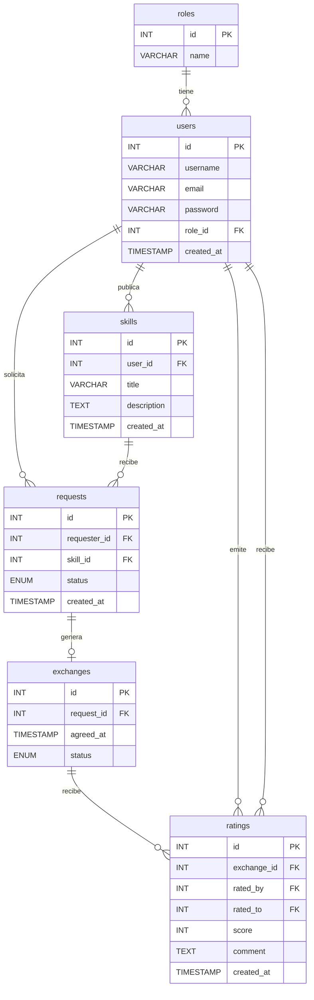

# Modelo relacional completo

## Entidades principales

- `roles`
- `users`
- `skills`
- `requests`
- `exchanges`
- `ratings`

## Diagrama ER



## Correcciones importantes

La relación de `ratings` debe quedar así:

- Un `exchange` puede tener varias valoraciones, normalmente una por cada participante.
- `ratings.exchange_id` apunta al intercambio que se valora.
- `ratings.rated_by` indica quién emite la valoración.
- `ratings.rated_to` indica quién la recibe.

La relación de `requests` con `exchanges` debe ser:

- Una `request` aceptada genera un solo `exchange`.
- Por eso la relación correcta es `1:0..1`, no `1:N`.
- Para reforzarlo en MySQL, `exchanges.request_id` debe ser `UNIQUE`.

## SQL sugerido

```sql
CREATE TABLE roles (
  id INT AUTO_INCREMENT PRIMARY KEY,
  name VARCHAR(50) NOT NULL UNIQUE
);

CREATE TABLE users (
  id INT AUTO_INCREMENT PRIMARY KEY,
  username VARCHAR(100) NOT NULL UNIQUE,
  email VARCHAR(150) NOT NULL UNIQUE,
  password VARCHAR(255) NOT NULL,
  role_id INT NOT NULL,
  created_at TIMESTAMP DEFAULT CURRENT_TIMESTAMP,
  FOREIGN KEY (role_id) REFERENCES roles(id) ON DELETE RESTRICT ON UPDATE CASCADE
);

CREATE TABLE skills (
  id INT AUTO_INCREMENT PRIMARY KEY,
  user_id INT NOT NULL,
  title VARCHAR(150) NOT NULL,
  description TEXT,
  created_at TIMESTAMP DEFAULT CURRENT_TIMESTAMP,
  FOREIGN KEY (user_id) REFERENCES users(id) ON DELETE CASCADE ON UPDATE CASCADE
);

CREATE TABLE requests (
  id INT AUTO_INCREMENT PRIMARY KEY,
  requester_id INT NOT NULL,
  skill_id INT NOT NULL,
  status ENUM('open','accepted','rejected') DEFAULT 'open',
  created_at TIMESTAMP DEFAULT CURRENT_TIMESTAMP,
  FOREIGN KEY (requester_id) REFERENCES users(id) ON DELETE CASCADE ON UPDATE CASCADE,
  FOREIGN KEY (skill_id) REFERENCES skills(id) ON DELETE CASCADE ON UPDATE CASCADE
);

CREATE TABLE exchanges (
  id INT AUTO_INCREMENT PRIMARY KEY,
  request_id INT NOT NULL UNIQUE,
  agreed_at TIMESTAMP NULL,
  status ENUM('pending','completed','cancelled') DEFAULT 'pending',
  FOREIGN KEY (request_id) REFERENCES requests(id) ON DELETE CASCADE ON UPDATE CASCADE
);

CREATE TABLE ratings (
  id INT AUTO_INCREMENT PRIMARY KEY,
  exchange_id INT NOT NULL,
  rated_by INT NOT NULL,
  rated_to INT NOT NULL,
  score INT NOT NULL,
  comment TEXT,
  created_at TIMESTAMP DEFAULT CURRENT_TIMESTAMP,
  FOREIGN KEY (exchange_id) REFERENCES exchanges(id) ON DELETE CASCADE ON UPDATE CASCADE,
  FOREIGN KEY (rated_by) REFERENCES users(id) ON DELETE CASCADE ON UPDATE CASCADE,
  FOREIGN KEY (rated_to) REFERENCES users(id) ON DELETE CASCADE ON UPDATE CASCADE,
  CONSTRAINT check_score CHECK (score BETWEEN 1 AND 5),
  CONSTRAINT check_rated_users CHECK (rated_by <> rated_to),
  UNIQUE KEY uq_rating_exchange_user (exchange_id, rated_by)
);
```

## Reglas de negocio

- Un usuario no puede solicitar su propia habilidad.
- Solo se crea un `exchange` cuando la `request` está aceptada.
- Una valoración solo se puede registrar cuando el intercambio está completado.
- Un usuario no puede valorarse a sí mismo.
- Un usuario solo debe poder valorar una vez por cada `exchange`.

## Normalización

- 1NF: todos los campos son atómicos.
- 2NF: cada tabla usa una clave primaria simple.
- 3NF: no hay dependencias transitivas, por ejemplo el rol no se repite dentro de `users`.

## Guion breve

Si tienes que explicarlo en clase, sigue este orden:

1. Primero explicas `roles`, `users` y `skills`.
2. Después cuentas cómo nace una `request`.
3. Luego explicas que una `request` aceptada crea un `exchange`.
4. Finalmente, las `ratings` sirven para valorar el intercambio y a la otra persona.
