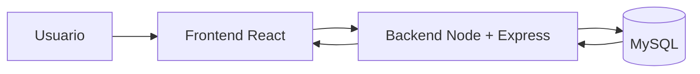

# Práctica 2: Arquitectura del proyecto

## Resumen

Mi proyecto es una plataforma de **trueque de habilidades técnicas**. La web permite que un usuario publique lo que sabe hacer, busque lo que quiere aprender y haga intercambios con otras personas.

## Arquitectura general

La aplicación sigue una arquitectura **cliente-servidor de 3 capas**:

```text
Usuario
  ↓
Frontend (React + Vite)
  ↓ HTTP / API REST
Backend (Node.js + Express)
  ↓ SQL
Base de datos (MySQL)
```

También puede entenderse como una **SPA** en el frontend, porque React permite cambiar de vista sin recargar toda la página.



## Capas del proyecto

### Frontend

- `components`: piezas reutilizables de la interfaz.
- `pages`: pantallas principales como login, perfil y listado.
- `services`: llamadas a la API.
- `context` y `hooks`: estado de sesión y lógica compartida.
- `styles`: estilos globales y componentes visuales.

### Backend

- `routes`: definen los endpoints.
- `controllers`: contienen la lógica de negocio.
- `models`: representan las tablas de MySQL.
- `middleware`: autentican, autorizan y validan.
- `config`: conexión a base de datos y variables de entorno.

## Tipo de arquitectura

La tipología principal es **cliente-servidor por capas**. Eso encaja con el proyecto porque:

1. El usuario interactúa desde el navegador.
2. El backend controla el login, los roles y las reglas del trueque.
3. MySQL guarda los usuarios, habilidades, solicitudes e intercambios.

## Ventajas

- Separación clara entre interfaz, lógica y datos.
- Más mantenimiento y más facilidad para ampliar la web.
- Mejor seguridad al controlar login y roles en el backend.
- Base sólida para añadir mensajería, valoraciones o filtros más adelante.

## Inconvenientes

- Requiere más configuración inicial.
- Necesita coordinar frontend, backend y base de datos.
- Si falla una capa, puede afectar al resto.
- La autenticación y los permisos añaden complejidad.

## Conclusión

La arquitectura elegida es adecuada para una web de trueque de habilidades porque organiza bien la información, permite crecer con facilidad y deja preparada la base para el login, los roles y los intercambios.
